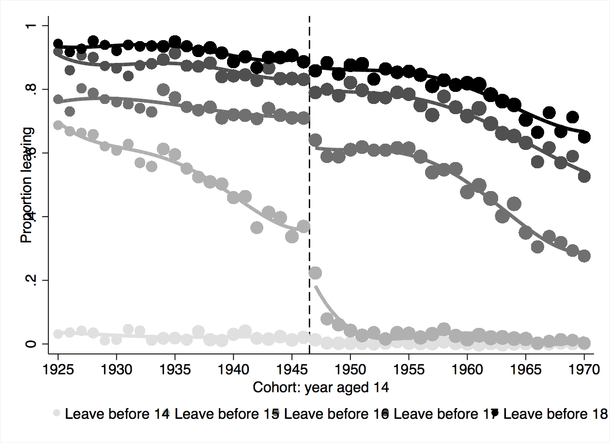
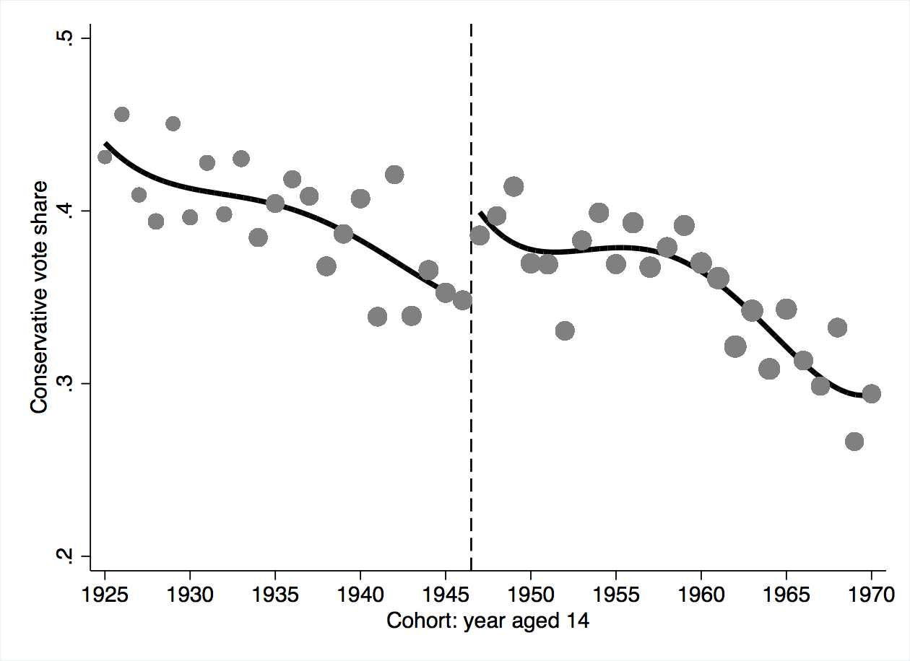
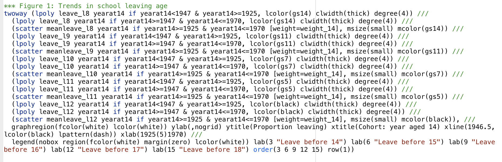
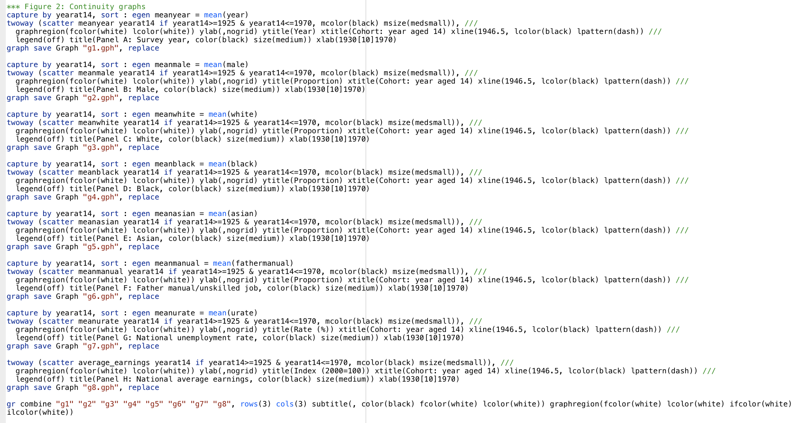
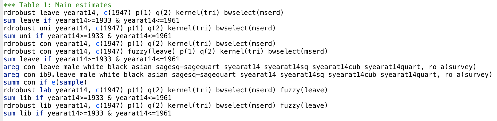
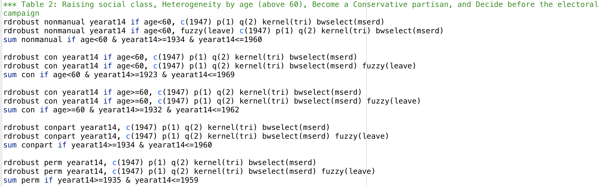

```{r setup, include=FALSE}
knitr::opts_chunk$set(echo = FALSE)

library(bookdown)
library(rdrobust)
library(gt)
library(tidyverse)

load("raw-data/UK Election Data Replication.RData")

```

## Abstract

Marshall (2015) shows the causal effect of additional years of schooling on voting conservative in his analysis og voting records before and after the British 1947 school-leaving age reform. Marshall's figures and the results of his tables were replicated in Stata, but an update in the rdrobust package lead to my modification of his bandwidth selection code, and thus slightly different coefficients. In an extension of Marshall's work I investigated how his observed effect differed between genders. Running rdrobust and creating regression discontinuity figures on male and female subsets of the data revealed the effect of more years of education increasing likelihood of voting conservative was much stronger in women than men. This finding could complicate Marshall's argument that more education leads to higher income and then to more conservative political opinions and perhaps reveals something about the differing effect of education on men and women. 


## Introduction and Conclusion

This paper by John Marshall uses data from the results of the 1947 high school leaving age reform in Great Britain, to analyze how additional years in high school affect political preferences [@main]. This paper looked specifically in how additional years in high school effected voting for the Conservative Party [@main]. In 1947, Great Britain changed the high school leaving age from 14 to 15, this induced almost half the student population to stay in school for at least 1 or 2 more years [@main]. Data from the 10 British elections between 1947 and 2010 was then used to compare voters young enough to have been effected by the reform to those who were too old to have been effected, using regression discontinuity [@main]. Regression discontinuity is usually used for determining if a program/treatment is effective, and essentially is is a pretest-posttest program-comparison group design strategy [@regression-discont]. Regression discontinuity is unique in that individuals are assigned to one of two groups, just based on if they are on either side of a pre-determined cut-off [@regression-discont].The results of data analysis revealed staying in high school for longer substantially increased likelihood to vote for the Conservative Party (staying one extra year increased probailitiy of voting Conservative by almost 12 percentage points) [@main]. This supports the previously studied fact that high school is extremely pertinent to political opinions later in life, and that more education generally leads to higher income and thus voting more conservative [@dev],[@meltz]. In addition, this significant finding indicates the education reform of 1947 may have had an even greater affect on politics and election results nationwide over many years than ever expected [@main]. 

The first aspect of this project was a replication of Marshall's results. His code and data are publically available on the [Harvard Dataverse](https://dataverse.harvard.edu/dataset.xhtml?persistentId=doi:10.7910/DVN/YJMGPP). In order to replication Marshall's results, I ran his original code--with a few modifications--in stata. Marshall's figures were able to be replicated by running stata code, but replicating the tables was met with some difficulty. First, the rdrobust package has been updated since 2015 and thus some of the arguments Marshall used have since been deprecated [@deprecated]. I was able to replace old arguments with their 'updated' versions, according to an update from the package authors in 2017 [@deprecated]. Changing this argument allowed the code to be run, but changed the values of the calculated coefficients by a bit. In addition, the code to go from raw output to polished table was not included in the replication code on the Dataverse, so I worked with Gov1006 Teaching Assistant Alice Xu to hard code the replication for table 1 (the main results table). All code for the replication is available in my github repo.^[[Link to Github Repo](https://github.com/mollyechiang/1006_milestone_5)].

After replication, my extension of Marshall's findings look at the effect of his findings when broken down by gender. In order to perform this analysis, I subsetted Marshall's data into a solely male and solely female.

Over the course of this paper, I will contextualize Marshall's 2015 paper in a literature review, dive more deeply into explaining my replication process, and show the results from my extension. The tables and figures I replicated from Marshall's paper are also included at the end of the paper.


## Literature Review

This paper is written as a response to mixed literature on education and voting preferences. On one hand, it has been suggested that education leads to more socially liberal attitudes. In 1959, Lipset proposed more education is assocaited with more liberal attitudes and support of democracy [@lipset]. Hyman and Wright support that analysis saying education leads to students thinking with a fundamentally liberal fashion [@hyman].

On the other hand, Devereux and Hart showed in 2010--using similar data and the same regression discontinuity analysis design--that additional years of schooling as a result of the 1947 reform increases wage by 5-15% [@dev]. In addition Meltzer and Richard (1981) have shown that higher wage earners prefer low income tax and government spending, policies aligned more closely with the British Conservative party [@meltz].

However, Marshall's paper was the first to directly address the causal effects of voting conservative and more years of education. This paper also used these past findings about the effect of education to help exaplin Marshall's findings.


## Replication Process

I was able to replicate all of the figures in the paper in stata. The code I ran and the output figures are included in the appendix. In terms of the tables, I was able to run all of the code in stata almost directly from Marshall's replication code. Some aspects I had to change because some of the functions he used have been updated since he wrote the paper, namely, when using rdrobust, the bwselect option IK and the h() argument are no longer functional, and have been replaced with an updated version bwselect(mserd), which I used in all the code. This modification was necessary because of the changes that have been made to the rdrobust package since 2015, and did change my values a bit from Marshall's. 

Although I was able to replicate the values of Marshall's tables by running his stata file (with modifications), I was unable to go from the raw results of the models Marshall ran to the polished tables I saw in his paper, as only code for the models were included in his .do file. The summary statistics for all of the tables (number of observations, outcome mean, etc) were replicated perfectly. However, switching the bandwidth selection did result in changes to the results of the rdrobust functions. Some values differed more than others from Marshall's values after changing to bwselect(mserd), but it seems when fuzzy regression discontinuity was run, the values differed less.
 
This paper relies heavily on rdrobust models, and the reference material for learning about this function and its package is from [@rdrobust].

My replication process was guided by advice from [@king].


## Extension

Marshall proved to us in "Education and Voting Conservative: Evidence from a Major Schooling Reform in Great Britain," that education attainment significantly increased after the 1847 school-leaving age reform in Great Britain. He deomstrated, using this reform and regression discontinuity design, that as years of schooling increased, so did one's likelihood to vote conservative, also ensuring other covariatives maintained continuity around this cutoff. In my extension of his work, I investigated how Marshall's results differed when subsetting his data for males and females. 

Creating regression discontinuity figures on just the male and female subsets of the data revealed the effect of more years of education increasing probabiliy of voting conservative was much stronger in women than men. In addition, when running rdrobust, the coefficient for the female subset was considerably higher than the coefficient of the male subset (with the both gender coeffecient being intermediate). 

The RDD I ran for the extension was based on what Marshall (2015) ran. I set my dependent variable to con (0 or 1 for if the individual voted conservative) and the independent variable to yearat14 (yearat14 of 1947 is the first class of individuals who were forced to stay in school an extra year). I set the cutoff to the year of the reform, 1947, and like Marshall, set the order of the point-estimator local-polynomial to 1, the order of the bias-correction local-polynomial to 2, and the kernal function to triangular. Finally, differing from Marshall, I set bwselect = "mserd," as that is the updated version of the now-deprecated bwselect(IK). The table with the results of these regression contains the standard-form coefficients and their associated standard error and p-values.

```{r rdrobust}

model1 <- rdrobust(table$con, table$yearat14, c = 1947, p = 1, q = 2, kernel = "tri", bwselect = "mserd", masspoints = "off")

#modelfuzzy <- rdrobust(table$con, table$yearat14, c = 1947, p = 1, q = 2, kernel = "tri", bwselect = "mserd", masspoints = "off", fuzzy = table$leave)
#- I used fuzzy(leave) for all - as fuzzy is used in instances where the assignment is not 100% yes or no - like in this case the government changed the law but it was not perfectly followed or enforced.

female <- table %>%
  filter(male == 0)

male <- table %>%
  filter(male == 1)

malemodel <- rdrobust(male$con, male$yearat14, c = 1947, p = 1, q = 2, kernel = "tri", bwselect = "mserd", masspoints = "off")

femalemodel <- rdrobust(female$con, female$yearat14, c = 1947, p = 1, q = 2, kernel = "tri", bwselect = "mserd", masspoints = "off")

```

```{r table, results = "asis"}

results_table <- data.frame(row = c("Estimated Effect of 1947 Reform", "Standard Error", "p-value", "Number of Observations"),
                    all = c(as.data.frame(model1["coef"])[1,1], 
                            as.data.frame(model1["se"])[1,1],
                            as.data.frame(model1["pv"])[1,1],
                            29396), 
                    male = c(as.data.frame(malemodel["coef"])[1,1],
                             as.data.frame(malemodel["se"])[1,1],
                             as.data.frame(malemodel["pv"])[1,1],
                             13745),
                    female = c(as.data.frame(femalemodel["coef"])[1,1],
                               as.data.frame(femalemodel["se"])[1,1],
                               as.data.frame(femalemodel["pv"])[1,1],
                               15661))

results_table %>%
  gt() %>%
  cols_label(all = "All-Gender",
             male = "Male",
             female = "Female", 
             row = " ") %>%
  tab_header(title = "Gender Breakdown of Schooling's Effect on Voting Conservative",
             subtitle = "Results of regression discontinuity analysis of a conservative vote around the 1947 school-leaving age reform in Great Britain") %>%
  fmt_number(columns = 2:4, rows = 1:3, decimals = 3) 

```

The coefficient when running RDD is an indicator of causailty of the forcing variable (in our case, years in school) on the observed variable (voting conservative) around the cutoff point (1947). Thus demonstrating years in school causes more conservative voting patterns in females more than it does in men. Thus, overall, students effected by the reform are 4.5 percentage points more likely to vote conservative. However, males of this group are 3.9 percentage points and females 5.3 percentage points more likely to vote conservative. Although neither of the male or female coefficients had a p-value less than .05 (traditionally indicating statistical significance), accepting uncertainty in our model and analyzing the magnitude of these p-values, we see the female coefficient p-value is an order of magnitude smaller, indicating the effect on females is more significant than on males.

The results of this extension complicate Marshall's argument that more education leads to higher income and then to more conservative political opinions. Women did not have a lot of space for income advancement in the 1940s and 50s in comparision to men, and thus Marshall's explanation would likely assume women would thus have a smaller increase in voting conservative in response to more education, but this extension shows the opposite.

In addition, this extension perhaps reveals something about the differing effect of education on men and women. Are women's political views more responsive to education? Women are generally more liberal then men, how does this result fit into this narrative? This extension certainly opens space for much more investigation on gender, education, and political views.


```{r women graph}

w <- table %>%
  select(yearat14, con, male) %>%
  filter(yearat14 >= 1925 & yearat14 <= 1970) %>%
  filter(male == 0)

num_per_year <- w %>%
  group_by(yearat14) %>%
  count()

num_con_per_year <- w %>%
  group_by(yearat14) %>%
  count(con) %>%
  filter(con == 1)

con_props <- left_join(num_per_year, num_con_per_year, by = "yearat14") %>%
  replace_na(list(con = 0, n.y = 0)) %>%
  summarize(con_prop = n.y/n.x) %>%
  mutate(group = c(rep("1", 23), rep("2", 23)))

ggplot(con_props, aes(x = yearat14, y = con_prop, color = group)) + 
  geom_point() +
  geom_vline(xintercept = 1947) + 
  geom_smooth(se = FALSE, method = "loess") +
  labs(title = "Conservative Vote Share in Females Before and After 1947",
       subtitle = "Proportion of each class voting conservative by cohort",
       x = "Cohort (year at age 14)",
       y = "Proportion of Cohort Voting Conservative",
       caption = "Figure 1: Illustrates the change in proportion of females in each class voting conservative around the \nimplementation of the school-leaving age reform in 1947. Curves represent fourth order polynomial fits on either \nside of the 1947 discontinuity") +
  theme(legend.position = "none",
        plot.caption = element_text(hjust = 0))

```

```{r men graph}

m <- table %>%
  select(yearat14, con, male) %>%
  filter(yearat14 >= 1925 & yearat14 <= 1970) %>%
  filter(male == 1)

num_per_year <- m %>%
  group_by(yearat14) %>%
  count()

num_con_per_year <- m %>%
  group_by(yearat14) %>%
  count(con) %>%
  filter(con == 1)

con_props <- left_join(num_per_year, num_con_per_year, by = "yearat14") %>%
  replace_na(list(con = 0, n.y = 0)) %>%
  summarize(con_prop = n.y/n.x) %>%
  mutate(group = c(rep("1", 23), rep("2", 23)))

ggplot(con_props, aes(x = yearat14, y = con_prop, color = group)) + 
  geom_point() +
  geom_vline(xintercept = 1947) + 
  geom_smooth(se = FALSE, method = "loess") +
  labs(title = "Conservative Vote Share in Men Before and After 1947",
       subtitle = "Proportion of each class voting conservative by cohort",
       x = "Cohort (year at age 14)",
       y = "Proportion of Cohort Voting Conservative",
       caption = "Figure 2: Illustrates the change in proportion of males in each class voting conservative around the \nimplementation of the school-leaving age reform in 1947. Curves represent fourth order polynomial fits on either \nside of the 1947 discontinuity") +
  theme(legend.position = "none",
        plot.caption = element_text(hjust = 0))


```


## Replicated Tables and Figures

```{r data for graphic}

# first select only the relevant columns and years 
# years 1925-1970 were used by Marshall in figure 3
# year at 14 gives the cohort year, and con is the column
# where 1 indicates voting conservative, and 0 is not

x <- table %>%
  select(yearat14, con) %>%
  filter(yearat14 >= 1925 & yearat14 <= 1970)

# in order to calculate the percentage of votes that were
# conservative each year I made two tables

# first I simply calculated the total number of individuals
# that were surveyed each year

num_per_year <- x %>%
  group_by(yearat14) %>%
  count()

# then I coundted the number of conservative votes in
# that year 

num_con_per_year <- x %>%
  group_by(yearat14) %>%
  count(con) %>%
  filter(con == 1)

# then I used left join to combine these two tables by year
# I replaced instances were the con or n.y (which was number
# of conservative votes that were 1) column was NA with 0 
# in order to include those instances in our calculations
# then I created a proportion column by dividing n.y (number
# of conservative votes) by n.x (number of voters per year)
# for each year

# I also split the table into two groups by creating a 
# group column. The groups were created by splitting the
# data about the year 1947, as was done in Figure 3 of 
# Marshall 2015, in order to see how voting conservative 
# changed after that year. 

con_props <- left_join(num_per_year, num_con_per_year, by = "yearat14") %>%
  replace_na(list(con = 0, n.y = 0)) %>%
  summarize(con_prop = n.y/n.x) %>%
  
  # 1925-1947 is 23 years and 1947-1970 is 23 years
  
  mutate(group = c(rep("1", 23), rep("2", 23)))

```

```{r graphic}

# here the graphic is created from the con_props data
# with yearat14 as the x axis and proportion that voted
# conservative as the y axis. The points were colored
# by their group (which side of 1947 they were on)

ggplot(con_props, aes(x = yearat14, y = con_prop, color = group)) + 
  geom_point() +
  
  # I added a geom_vline at 1947 so the year would be 
  # more obvious when looking at the graph
  
  geom_vline(xintercept = 1947) + 
  
  # I added best fit lines to each side of 1947
  # method was set to loess  to get a polynomial
  # fit for each group as was done in Figure 3 of
  # Marshall 2015
  
  geom_smooth(se = FALSE, method = "loess") +
  
  # titles, labels, and caption was then added
  
  labs(title = "Conservative Vote Share Before and After 1947",
       subtitle = "A replication of Figure 3 from Marshall 2015 in R",
       x = "Cohort (year at age 14)",
       y = "Proportion of Cohort Voting Conservative",
       caption = "Figure 3: This figure is a replication of Figure 3 (Marshall 2015) in R instead of Stata, it illustrates the jump in \nproportion of a cohort, or class, of British individuals (classified by the year at which they were 14), after the \neducation reform in 1947 which increased the year at which you could legally leave high school from 14 to 15.") +
  
  # remove legend and right align caption
  
  theme(legend.position = "none",
        plot.caption = element_text(hjust = 0))

```








## Appendix (Code)

<p>

</p>

<p>

</p>

<p>

</p>

<p>

</p>

<p>

</p>

\newpage 

## References

Reference material to create this bibliography comes from [@bib]


