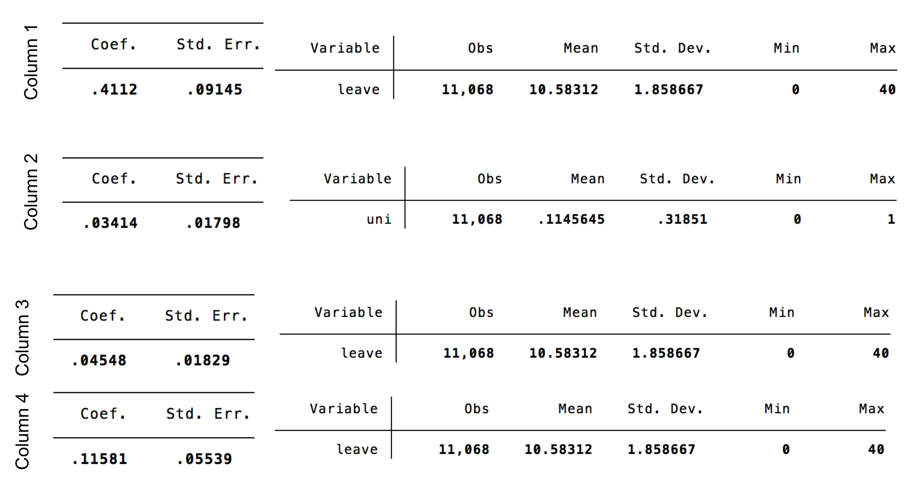
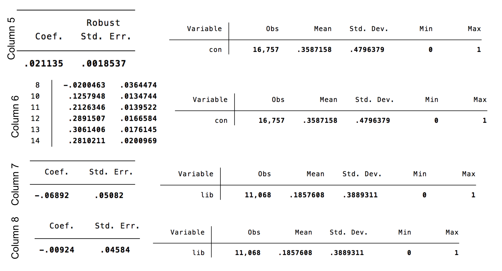
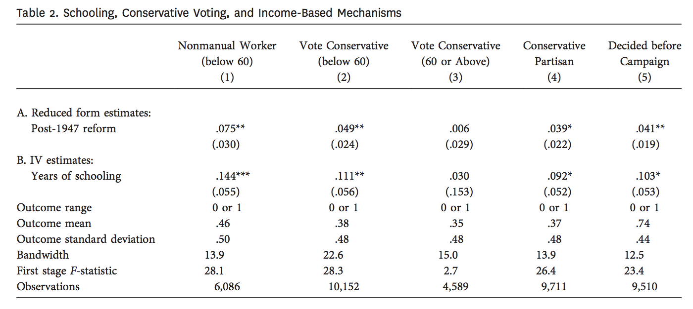
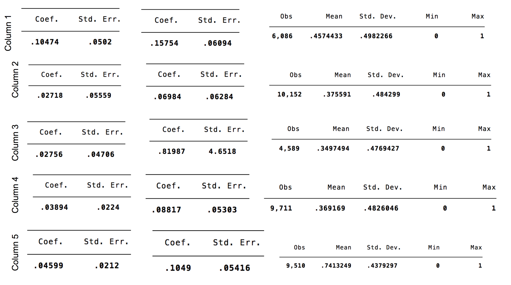

```{r setup, include=FALSE}
knitr::opts_chunk$set(echo = FALSE)

library(rdrobust)
library(tidyverse)

load("raw-data/UK Election Data Replication.RData")

```

## Abstract

This is an extension of Marshall (2015), which shows the causal effect of additional years of schooling on voting conservative via regression discontinuty analysis on voting records of individuals before and after the British 1947 school-leaving age reform. This extension aims to see if the same effect is found in an analysis of a later education reform in England.


## Introduction

This paper by John Marshall uses data from the results of the 1947 high school leaving age reform in Great Britain, to analyze how additional years in high school affect political preferences [@main]. This paper looked specifically in how additional years in high school effected voting for the Conservative Party [@main]. In 1947, Great Britain changed the high school leaving age from 14 to 15, this induced almost half the student population to stay in school for at least 1 or 2 more years [@main]. Data from the 10 British elections between 1947 and 2010 was then used to compare voters young enough to have been effected by the reform to those who were too old to have been effected, using regression discontinuity [@main]. Regression discontinuity is usually used for determining if a program/treatment is effective, and essentially is is a pretest-posttest program-comparison group design strategy [@regression-discont]. Regression discontinuity is unique in that individuals are assigned to one of two groups, just based on if they are on either side of a pre-determined cut-off [@regression-discont].The results of data analysis revealed staying in high school for longer substantially increased likelihood to vote for the Conservative Party (staying one extra year increased probailitiy of voting Conservative by almost 12 percentage points) [@main]. This supports the previously studied fact that high school is extremely pertinent to political opinions later in life, and that more education generally leads to higher income and thus voting more conservative [@dev],[@meltz]. In addition, this significant finding indicates the education reform of 1947 may have had an even greater affect on politics and election results nationwide over many years than ever expected [@main]. 


The first aspect of this project was a replication of Marshall's results. His code and data are publically available on the [Harvard Dataverse](https://dataverse.harvard.edu/dataset.xhtml?persistentId=doi:10.7910/DVN/YJMGPP). In order to replication Marshall's results, I ran his original code--with a few modifications--in stata. Marshall's figures were able to be replicated by running stata code, but replicating the tables was met with some difficulty. First, the rdrobust package has been updated since 2015 and thus some of the arguments Marshall used have since been deprecated [@deprecated]. I was able to replace old arguments with their 'updated' versions, according to an update from the package authors in 2017 [@deprecated]. Changing this argument allowedthe code to be run, but changed the values of the calculated coefficients by a bit. In addition, the code to go from raw output to polished table was not included in the replication code on the Dataverse, so I worked with Gov1006 Teaching Assistant Alice Xu to hard code the replication for table 1 (the main results table). All code for the replication is available in my github repo.^[[Link to Github Repo](https://github.com/mollyechiang/1006_milestone_5)].

After replication, I performed an extension on Marshall's original findings.
(third and fourth paragraphs about what I did for extension and what I found)

Over the course of this paper, I will contextualize Marshall's 2015 paper in a literature review, dive more deeply into explaining my replication process, and show the results from my extension. The tables and figures I replicated from Marshall's paper are also included at the end of the paper. (add more speculation at the end)


## Literature Review

This paper is written as a response to mixed literature on education and voting preferences. On one hand, it has been suggested that education leads to more socially liberal attitudes. In 1959, Lipset proposed more education is assocaited with more liberal attitudes and support of democracy [@lipset]. Hyman and Wright support that analysis saying education leads to students thinking with a fundamentally liberal fashion [@hyman].

On the other hand, Devereux and Hart showed in 2010--using similar data and the same regression discontinuity analysis design--that additional years of schooling as a result of the 1947 reform increases wage by 5-15% [@dev]. In addition Meltzer and Richard (1981) have shown that higher wage earners prefer low income tax and government spending, policies aligned more closely with the British Conservative party [@meltz].

However, Marshall's paper was the first to directly address the causal effects of voting conservative and more years of education. This paper also used these past findings about the effect of education to help exaplin Marshall's findings.


## Replication Process

I was able to replicate all of the figures in the paper in stata. The code I ran and the output figures are included in the appendix. In terms of the tables, I was able to run all of the code in stata almost directly from Marshall's replication code. Some aspects I had to change because some of the functions he used have been updated since he wrote the paper, namely, when using rdrobust, the bwselect option IK and the h() argument are no longer functional, and have been replaced with an updated version bwselect(mserd), which I used in all the code. This modification was necessary because of the changes that have been made to the rdrobust package since 2015, and did change my values a bit from Marshall's. 

Although I was able to replicate the values of Marshall's tables by running his stata file (with modifications), I had a lot of trouble going from the raw results of the models Marshall ran to the polished tables I saw in his paper, as only code for the models were included in his .do file. Thus, I have included screenshots of the raw code and the relevant aspects of the output that would be included in the table in the paper. I hope to learn more basics of stata in order to compile and nicely display these raw outputs from Marshall's code.

For brevity, I did only included the screenshots from tables 1 and 2 and not table 3 (as it would be a lot of seperate screenshots to include), but I have included the table 3 code, which was run in the same way. Table 4 was not able to be replicated as there was no code for table 4 included in Marshall's replication code.

This paper relies heavily on rdrobust models, and the reference material for learning about this function and its package is from [@rdrobust].

My replication process was guided by advice from [@king].


## Extension

I believe there are two routes I could take with a proposed extension of the work in "Education and Voting Conservative: Evidence from a Major Schooling Reform in Great Britain" by John Marshall. 

First, I could look at other factors that may have been influenced by the 1947 leaving age reform. This would involve doing a similar regression discontinuity analysis of other variables around the year 1947, but in R instead of stata. For example, did this reform lead to an uptick in college educated people? Or in another vein, how did the distribution of voting in all parties, liberal, labour, and conservative change after the reform, do we see a corresponding downtick in the other parties to go along with the observed uptick in conservative voting? In addition, I think that I could, using some of the adivce from RAOS, find more exciting/visually pleasing ways to display the results of these regression analyses. 

On the other hand, I could use this data to look at the effect of other education reforms that have happened over the course of British history. There was a big education reform in England in 1988 [@wik]. This reform including introducing a national curriculum and corresponding national curriculum assesments, as well as modifying religious education [@wik]. Although this reform did not result in increased years of school (so it would not be able to be compared to Marshall's main findings in that way), I think it could be interesting if this reform in content and uniformity of the British public education had any effect on voting preferences of the first classes to appreciate this reform (just as Marshall analyzed those who first appreciated the 1947 reform). Again, there could be issues in that this reform required more instiutional changes than an easy age cut-off, and thus likely took longer to implement, but the results could still be interesting. In addition, the results could shed light on Marshall's finidings and if they are specifically correlated with more years in school, or are perhaps a response to government intervention via school reforms. 

In addition to the 1988 education reform, the school leaving age was increased to 16 years of age in officially in 1996 [@wik]. This may pose an issue because Marshall's data only goes to 2010 (so we would have much more data on pre-reform individuals than post-reform indivudals), but would be very, very interesting addition to the findings of Marshall (2015), as it could really support the idea that additional years of school being associated with more conservative voting, if there was a similar uptick around this year. Additionally, if it did not show an uptick, it could show that perhaps Marshall discovered a unique effect of the 1947 British education reform, but not of more years of education in general.

## Conclusion

5 paragraphs
 

## Tables and Figures


```{r data for graphic}

# first select only the relevant columns and years 
# years 1925-1970 were used by Marshall in figure 3
# year at 14 gives the cohort year, and con is the column
# where 1 indicates voting conservative, and 0 is not

x <- table %>%
  select(yearat14, con) %>%
  filter(yearat14 >= 1925 & yearat14 <= 1970)

# in order to calculate the percentage of votes that were
# conservative each year I made two tables

# first I simply calculated the total number of individuals
# that were surveyed each year

num_per_year <- x %>%
  group_by(yearat14) %>%
  count()

# then I coundted the number of conservative votes in
# that year 

num_con_per_year <- x %>%
  group_by(yearat14) %>%
  count(con) %>%
  filter(con == 1)

# then I used left join to combine these two tables by year
# I replaced instances were the con or n.y (which was number
# of conservative votes that were 1) column was NA with 0 
# in order to include those instances in our calculations
# then I created a proportion column by dividing n.y (number
# of conservative votes) by n.x (number of voters per year)
# for each year

# I also split the table into two groups by creating a 
# group column. The groups were created by splitting the
# data about the year 1947, as was done in Figure 3 of 
# Marshall 2015, in order to see how voting conservative 
# changed after that year. 

con_props <- left_join(num_per_year, num_con_per_year, by = "yearat14") %>%
  replace_na(list(con = 0, n.y = 0)) %>%
  summarize(con_prop = n.y/n.x) %>%
  
  # 1925-1947 is 23 years and 1947-1970 is 23 years
  
  mutate(group = c(rep("1", 23), rep("2", 23)))

```

```{r graphic}

# here the graphic is created from the con_props data
# with yearat14 as the x axis and proportion that voted
# conservative as the y axis. The points were colored
# by their group (which side of 1947 they were on)

ggplot(con_props, aes(x = yearat14, y = con_prop, color = group)) + 
  geom_point() +
  
  # I added a geom_vline at 1947 so the year would be 
  # more obvious when looking at the graph
  
  geom_vline(xintercept = 1947) + 
  
  # I added best fit lines to each side of 1947
  # method was set to loess  to get a polynomial
  # fit for each group as was done in Figure 3 of
  # Marshall 2015
  
  geom_smooth(se = FALSE, method = "loess") +
  
  # titles, labels, and caption was then added
  
  labs(title = "Proportion of Cohorts Voting Conservative Before and After 1947",
       subtitle = "A replication of Figure 3 from Marshall 2015 in R",
       x = "Cohort (year at age 14)",
       y = "Proportion of Cohort Voting Conservative",
       caption = "Figure 1: This figure is a replication of Figure 3 (Marshall 2015) in R instead of Stata, it illustrates the jump in \nproportion of a cohort, or class, of British individuals (classified by the year at which they were 14), after the \neducation reform in 1947 which increased the year at which you could legally leave high school from 14 to 15.") +
  
  # remove legend and right align caption
  
  theme(legend.position = "none",
        plot.caption = element_text(hjust = 0))

```


 






## Appendix (Code)

<p>

</p>

<p>

</p>

<p>

</p>

<p>

</p>

<p>

</p>

\newpage 

## References

Reference material to create this bibliography comes from [@bib]


